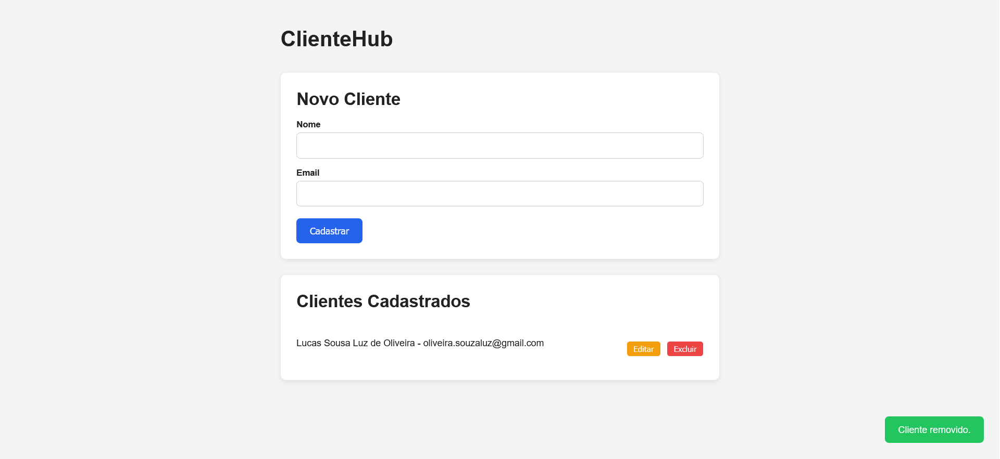

# ClienteHub

Aplicação web para cadastrar, listar, editar e excluir clientes, desenvolvida para praticar o consumo de APIs REST com Fetch API nativa do JavaScript.

---

## 📷 Preview



---

## 🚀 Funcionalidades

- ✅ **Listar** clientes cadastrados (GET)
- ✅ **Cadastrar** novo cliente via formulário (POST)
- ✅ **Editar** nome e e-mail de um cliente (PUT)
- ✅ **Excluir** cliente da lista (DELETE)
- ✅ Feedback visual com toasts de sucesso e erro
- ✅ Validação de campos antes de enviar à API

---

## 🛠️ Tecnologias utilizadas

- HTML5
- CSS3
- JavaScript (ES6+)
- [Fetch API](https://developer.mozilla.org/pt-BR/docs/Web/API/Fetch_API)
- [CrudCrud](https://crudcrud.com) — API REST gratuita para fins de estudo

---

## 📁 Estrutura do projeto

```
clientehub/
├── index.html          # Interface da aplicação
├── styles.css          # Estilização
├── assets/
│   └── preview.png     # Screenshot da aplicação
├── js/
│   ├── app.js          # Código principal e orquestração
│   ├── classes.js      # Classe Cliente (POO + encapsulamento)
│   └── utils.js        # Funções auxiliares puras
└── README.md
```

---

## ⚙️ Como executar localmente

1. Clone o repositório:
```bash
git clone https://github.com/lucassloliveira/clientehub.git
```

2. Acesse [crudcrud.com](https://crudcrud.com) e copie o seu endpoint único.

3. No arquivo `js/app.js`, substitua o token na constante API_URL:
```js
const API_URL = "https://crudcrud.com/api/SEU_TOKEN_AQUI/clientes";
```

4. Abra o `index.html` no navegador — recomendado usar a extensão [Live Server](https://marketplace.visualstudio.com/items?itemName=ritwickdey.LiveServer) do VS Code.

> ⚠️ O token do CrudCrud expira após 100 requisições ou ~24h. Se a API parar de responder, gere um novo token no site e atualize a `API_URL`.

---

## 📡 Endpoints utilizados

| Método | Endpoint | Ação |
|--------|----------|------|
| GET | `/clientes` | Lista todos os clientes |
| POST | `/clientes` | Cadastra um novo cliente |
| PUT | `/clientes/:id` | Atualiza um cliente existente |
| DELETE | `/clientes/:id` | Remove um cliente |

---

## 💡 Aprendizados

- Consumo de APIs REST com `fetch()`
- Métodos HTTP: GET, POST, PUT e DELETE
- Uso de `async/await` para lidar com operações assíncronas
- Tratamento de erros com `try/catch`
- Manipulação dinâmica do DOM
- Uso de atributos `data-*` para associar dados a elementos HTML
- Depuração com DevTools (Console e aba Network)
- Modularização com ES Modules (import/export)
- Programação Orientada a Objetos (classes, encapsulamento com #campos privados)
- Factory Method estático para tradução de dados da API
- Programação funcional com map(), forEach() e reduce()
- Separação de responsabilidades em modules (classes.js, utils.js, app.js)
- Validação de e-mail com expressão regular (regex)

---

## 👨‍💻 Autor

Desenvolvido como projeto prático do curso de Front-End na EBAC.
